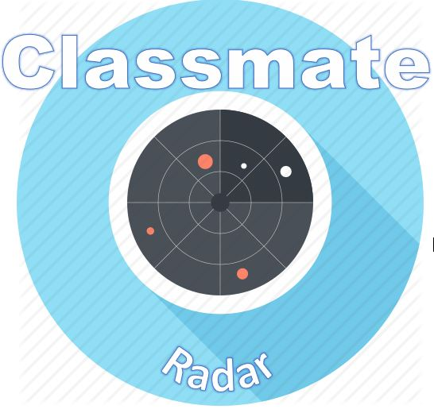

<h1 style="text-align:center">Classmate Radar</h1>
<h1> <a href="https://classmateradar.herokuapp.com/">Link to classmate radar website </h1>
 
 
 
   

 

<h2>What is class mate radar?</h2>

It is a web-app to get proximity of classmates.It tells you the distance of your classmates from you taking in reference their last active position on website

## Built by -Arpit Srivastava <a href="https://github.com/fuzious">@Fuzious</a> Follow me on github for many more exciting projects like these

  
